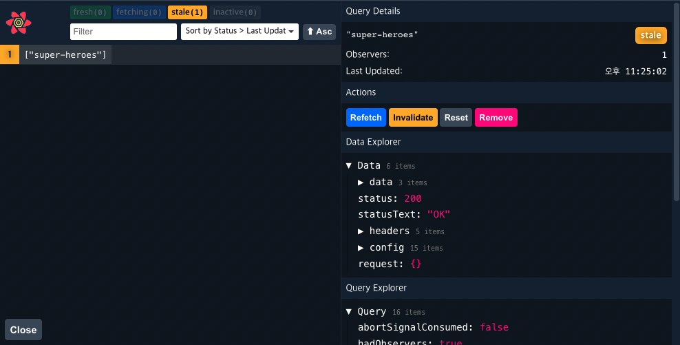
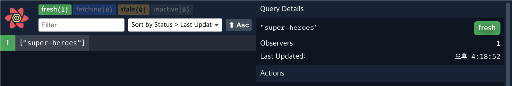
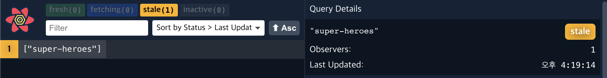

# React-query

https://www.youtube.com/watch?v=VtWkSCZX0Ec&list=PLC3y8-rFHvwjTELCrPrcZlo6blLBUspd2

https://react-query.tanstack.com/overview

https://kyounghwan01.github.io/blog/React/react-query/basic/#usequery
<br/>

# `What is?`

리액트 어플리케이션에서 데이타를 fetching하는 라이브러리
<br/>

# `Why`

1.  특정한 데이터 패칭 패턴이 없었다.

2.  useEffect 훅으로 데이터를 패칭하고 useState로 컴포넌트 내 state에서 loading, error나 결과 데이터를 유지해야했다.

3.  만약 데이터가 어플리케이션에 머무는 내내 필요하다면, 전역 상태 관리 라이브러리들로 유지하려는 경향들이 있다.

4.  대부분의 상태관리 라이브러리들은 정작 client State를 관리하는데 효율이 좋았다.

5.  대부분의 상태관리 라이브러리들은 비동기나 server state 작업에서 안좋다.
    - 캐싱... (아마도 프로그래밍에서 가장 어려운 일)
    - 동일한 데이터에 대한 여러 요청을 단일 요청으로 중복 제거
    - 백그라운드에서 "오래된" 데이터 업데이트
    - 데이터가 "오래된" 경우 파악
    - 데이터 업데이트를 최대한 빨리 반영
    - 페이지 매김 및 지연 로딩 데이터와 같은 성능 최적화
    - 서버 상태의 메모리 및 가비지 수집 관리
    - 구조적 공유를 통한 쿼리 결과 메모

```
React Query는 서버 상태를 관리하는 데 가장 좋은 라이브러리 중 하나입니다.
제로 구성으로 놀라울 정도로 즉시 사용할 수 있으며,
애플리케이션의 성장에 따라 원하는 대로 사용자 지정할 수 있습니다.
```

<br/>
<br/>

# `예전 데이터 패칭 방식`

```jsx
const RQSuperHeroesPage = () => {
	// fetching 관련 state 만들고
	const [isLoading, setIsLoading] = useState(true);
	const [data, setData] = useState([]);

	useEffect(() => {
		// useEffect에서 비동기함수 마운트에 실행하고
		axios.get("http://localhost:4000/superheroes").then((res) => {
			setData(res.data);
			setIsLoading(false);
		});
	}, []);

	if (isLoading) {
		return <h2>Loading...</h2>;
	}

	return (
		<>
			<h2>Super Heroes Page</h2>
			{data.map((hero) => {
				return <div>{hero.name}</div>;
			})}
		</>
	);
};
```

> 이제 react-query로 3줄안에 구현할 수 있다.

```jsx
import { useQuery } from "react-query";
import axios from "axios";

const fetchSuperHeroes = () => {
	return axios.get("http://localhost:4000/superheroes");
};

const RQSuperHeroesPage = () => {
	// useQuery 훅스의 첫번째 인자는 key, 이걸로 유니크한 아이디를 만들어 캐싱데이터를 저장하고 추적한다.
	// 두번째는 promise을 리턴하는 함수다.
	const { isLoading, data } = useQuery("super-heroes", fetchSuperHeroes);

	if (isLoading) {
		return <h2>Loading...</h2>;
	}
	return (
		<>
			<h2>Super Heroes Page</h2>
			{data?.data.map((hero) => {
				return <div key={hero.name}>{hero.name}</div>;
			})}
		</>
	);
};

export default RQSuperHeroesPage;
```

<br/>

# `Devtools`

react-query에서는 시각적으로 확인할 수 있게 devtool도 지원한다.

```tsx
import { ReactQueryDevtools } from "react-query/devtools";

export default () => {
	return (
		<>
			<ReactQueryDevtools initialisOpen={false} position='botton-right' />
			// 브라우저에서 Next.js처럼 devtool 아이콘 확인 가능
		</>
	);
};
```



<br/>
<br/>

# `Cache`

네트워크 탭에서 네트워크 속도를 낮추고 페이지를 왔다리 갔다리 해보면

첫 요청 이후로 loading없이 데이터가 바로 오는 걸 확인할 수 있다.

**react-query에서 캐싱된 데이터를 가져왔기 때문이다.**

```tsx
const { isLoading, data, error, isError } = useQuery(
	"super-heroes",
	fetchSuperHeroes,
	{
		cacheTime: 5000, // 기본적으로 5분마다 삭제되지만 조정할 수도 있다.
	}
);
```

<br/>

# `StaleTime`

    클라이언트가 fetch를 해 데이터(Fresh)를 받고나서 서버단이 데이터를 업데이트한다고 하면

    그때부터 클라이언트의 데이터(Stale)과 서버단의 데이터가 다를 것이다.

    이런 의미에서 Fresh/Stale로 구분한다.

<br/>

### 1. `Fresh`



<em>fetch를 한 후 30초동안은 fresh 상태에 머무르는데 이때는 아래 명시된 상황이 있어도 refetch를 하지 않는다.</em>
<br/>

### 2. `Stale`



Fetch 후 데이터는 Fresh 상태에서 `stale("뜻: 상한, 낡은") 상태`로 전환되며

다음 경우에 refetch를 한다.

    1. page를 이동 했다가 왔을 때, 새로운 query instance가 마운트 될 때 (refetchOnMount)

    2. 브라우저 화면을 이탈 했다가 다시 focus 할 때 (refetchOnWindowFocus)

    3. 네트워크가 다시 연결될 때 (refetchOnReconnect)

    4. 특별히 설정한 refetch interval에 의한 경우 (refetchInterval)

관련상황마다 option으로 refetch를 할지 말지 정할 수 있다

```ts
const { isLoading, data, error, isError } = useQuery(
	"super-heroes",
	fetchSuperHeroes,
	{
		refetchOnMount: false,
		refetchOnWindowFocus: false,
		refetchOnReconnect: false,
		refetchInterval: false, // 숫자를 주면 폴링 기능 (주기적으로 refetch)
	}
);
```

<br/>

### 3. `StaleTime을 쓰는 이유`

랜딩 페이지의 소개글처럼 바뀔 일 없는 데이터는 굳이 refetch를 하는 게 불만일수 있다.

> staleTime 옵션은 data가 fresh에서 stale로 전환되는 시간을 의미한다.

```tsx
const { isLoading, data, error, isError } = useQuery(
	"super-heroes",
	fetchSuperHeroes,
	{
		staleTime: 30000,
	}
);
```

네트워크탭에서 staleTime의 시간동안 refetch가 일어나지않는 걸 확인할 수 있다.

<br/>

# `enabled 옵션`

```tsx
const { isLoading, data, error, isError } = useQuery(
	"super-heroes",
	fetchSuperHeroes,
	{
		enabled: false,
		// enable의 값을 flag로 우리가 원하는 시점에 fetch하게 할 수 있다.
	}
);
```

<br/>

# `callback`

요청 성공 시, 실패 시에 콜백을 실행시킬 수 있다.

```tsx
const onSuccess = (data: HeroResponseTypes) => {
	console.log(data);
};

const onError = (e: Error) => {
	console.log(e.message);
};

const { isLoading, data, error } = useQuery("super-heroes", fetchSuperHeroes, {
	onSuccess,
	onError,
});
```

<br/>

# `data transform`

select 옵션은 인자로 응답 데이터를 주고 변형할 수 있게 도와준다.

```tsx
const RQSuperHeroesPage = () => {
	const { data } = useQuery("super-heroes", fetchSuperHeroes, {
		select: (data) => {
			const newData = data.data.map((v) => ({
				...v,
				name: v.name ?? "홍길동",
				// 만약 빈값이면 디폴트값 주게 설정
			}));

			return { ...data, data: newData };
		},
	});

	return (
		<>
			{data?.data.map((hero) => {
				return <div key={hero.name}>{hero.name}</div>;
			})}
		</>
	);
};

export default RQSuperHeroesPage;
```

<br/>

# `custom hooks`

```ts
// useSuperhero.js
import axios from "axios";
import { useQuery } from "react-query";

const fetchSuperHeroes = () => {
	return axios.get("http://localhost:4000/superheroes");
};

export default () => {
	return useQuery("super-heroes", fetchSuperHeroes);
};
```

> 자주 쓰이는 url 쿼리거나 로직이 복잡하여 분리하고 싶다면 커스텀 훅스로 만들면 좋다.

```ts
// RQSuperHeroesPage.jsx
import useSuperHeroes from "../hooks/useSuperHeroes";

const RQSuperHeroesPage = () => {
	const { data } = useSuperHeroes();

	return (
		<>
			<h2>Super Heroes Page</h2>
			{data?.data.map((hero) => {
				return <div key={hero.name}>{hero.name}</div>;
			})}
		</>
	);
};

export default RQSuperHeroesPage;
```

<br/>

# `Query by Id`


useQuery의 첫 번째 인자인 유니크 키는 string 또는 배열을 받는데

해당 요청의 관련 parameter들을 같이 등록할 수 있다.

```ts
import axios from "axios";
import { useQuery } from "react-query";

const fetchSuperHeroes = ({ queryKey }) => {
	const heroId = queryKey[1];
	return axios.get(`http://localhost:4000/superheroes/${heroId}`);
};

export default (heroId) => {
	return useQuery(["super-hero-data", heroId], fetchSuperHeroes);
};
```

<br/>

# `Parallel Queries`

가끔씩 한 컴포넌트에서 여러개의 api를 요청해야될 때가 있다.

그럴 때는 그냥 선언하면 된다.

```tsx
import React from "react";
import axios from "axios";
import { useQuery } from "react-query";

const fetchSuperHeroes = () => {
	return axios.get("http://localhost:4000/superheroes");
};

const fetchFriends = () => {
	return axios.get("http://localhost:4000/friends");
};

const PharelledQueryPage = () => {
	const { data: superheroesData } = useQuery("super-heroes", fetchSuperHeroes);
	const { data: friendsData } = useQuery("friends", fetchFriends);

	return <div>PharelledQueryPage</div>;
};

export default PharelledQueryPage;
```

useQueries를 활용하면 Promise.all처럼 여러개의 쿼리 인스턴스를 생성할 수 있다.

```tsx
import React from "react";
import axios from "axios";
import { useQueries } from "react-query";

const fetchSuperHero = (heroId) => {
	return axios.get(`http://localhost:4000/superheroes/${heroId}`);
};

const DynamicParaell = ({ heroIds }) => {
	const results = useQueries(
		heroIds.map((id) => {
			return {
				queryKey: ["super-hero", id],
				queryFn: () => fetchSuperHero(id),
			};
		})
	);
	console.log(results);
	return <div>DynamicParaell</div>;
};

export default DynamicParaell;
```

<br/>

# `Dependent Queries`

react-query는 유효하지 않는 파라미터라도 일단 fetch를 하고 보는데

enabled옵션에서 참조하게 하여 `뻘?fetch`를 막을 수 있다.

history api를 참조하거나 next.js에서 hydration 과정에서

쿼리를 늦게 들고올 수 있어 이런식으로 대처한다.

```ts
const { data: user } = useQuery(["user", email], getUserByEmail);

const userId = user?.id;

const { isIdle, data: projects } = useQuery(
	["projects", userId],
	getProjectsByUser,
	{
		// !!로 Booelan으로 형변환하는 과정을 대체할 수 있다.
		enabled: !!userId,
	}
);
```

<br/>

# `Initial Query Data`

    There are many ways to supply initial data for a query to the cache before you need it:

만약 리스트를 받는 요청을 했는데 그안에 해당 id의 디테일한 내용도 같이 있었다면

**우리는 id 페이지에서 또 fetch를 해야될까?**

initialData옵션과 useQueryClient를 통해

생성된 쿼리인스턴스에서 캐시된 정보를 가져오는 것도 가능하다.

```tsx
import axios from "axios";
import { useQuery, useQueryClient } from "react-query";

const fetchSuperHeroes = ({ queryKey }) => {
	const heroId = queryKey[1];
	return axios.get(`http://localhost:4000/superheroes/${heroId}`);
};

export default (heroId) => {
	const queryClient = useQueryClient();
	return useQuery(["super-hero-data", heroId], fetchSuperHeroes, {
		initialData: () => {
			const hero = queryClient
				.getQueryData("super-heroes")
				?.data?.find((hero) => hero.id === +heroId);
			// queryClient에서 캐싱되어있는 데이터가 없다면
			// 기존의 fetchSuperHeroes를 실행
			// 아니라면 "super-heroes"에 캐싱된 데이터를 가져올 것이다.

			return hero
				? {
						data: hero,
				  }
				: undefined;
		},
		// slow 3g로 테스트해보면 id페이지에서 새로고침할땐 로딩이 있지만
		// 리스트페이지에서 id페이지로 이동할 땐 로딩이 없는 것을 확인할 수 있다.
	});
};
```

<br/>

# 페이징 처리하는 방법들

    react-query는 페이징 처리도 너무... 편하다!

### 1. `Paginated Queries`

keepPreviousData 옵션을 통해 UX도 개선가능하다.

```tsx
import axios from "axios";
import React, { useState } from "react";
import { useQuery } from "react-query";

const fetchColors = (page) => {
	// json-server는 _limit와 _page 기능을 제공한다.
	return axios.get(`http://localhost:4000/colors?_limit=2&_page=${page}`);
};

const Paginate = () => {
	const [page, setPage] = useState(1);
	const { isLoading, isError, error, data, isFetching } = useQuery(
		["colors", page],
		() => fetchColors(page),
		{
			keepPreviousData: true,
			// 페이징은 잘되지만 매 fetch마다 loading처리를 보게 된다.
			// UX를 위해 이제 fetch가 다 끝나고 나서야 데이터를 교체하게 설정할 수 있다.
		}
	);

	if (isLoading) {
		return <h2>Loading...</h2>;
	}

	if (isError) {
		return <h2>{error.message}</h2>;
	}
	return (
		<div>
			<div>
				{data?.data.map((color) => {
					return (
						<div key={color.id}>
							<h2>
								{color.id}. {color.label}
							</h2>
						</div>
					);
				})}
			</div>
			<div>
				<button
					onClick={() => setPage((page) => page - 1)}
					disabled={page === 1}
				>
					Prev Page
				</button>
				<button
					onClick={() => setPage((page) => page + 1)}
					disabled={page === 4}
				>
					Next Page
				</button>
			</div>
		</div>
	);
};

export default Paginate;
```

<br/>

### 2. `Infinite Queries`

흔히 만드는 페이징 관련 상태나 함수를 react-query가 제공해준다.

정말 편하게 페이징처리로직을 짤 수 있다.

`hasNextPage`: 다음 페이지가 있는지 boolean으로 줌

`fetchNextPage`: 다음 파라미터로 fetch할 함수

Next.js 옵션들 중`getNextPageParam, getPreviousPageParam`는

로드할 데이터가 더 있는지 여부와 가져올 정보를 결정하는 데 사용할 수 있습니다.

```tsx
import { useInfiniteQuery } from "react-query";
import axios from "axios";

const fetchColors = ({ pageParam = 1 }) => {
	return axios.get(`http://localhost:4000/colors?_limit=2&_page=${pageParam}`);
};

const Infinite = () => {
	const {
		isLoading,
		isError,
		error,
		data,
		fetchNextPage,
		hasNextPage,
		isFetching,
		isFetchingNextPage,
	} = useInfiniteQuery(["colors"], fetchColors, {
		getNextPageParam: (_lastPage, pages) => {
			/*
				_lastPage에서는 현재 요청한 데이터의 정보
				pages는 지금까지 누적된 데이터의 정보

				보통 rest를 작업하다보면 요청마다 총 total 페이지 개수를 받게 된다.
				아래 코드에서는 total 개수를 명시해줘서 
				4보다 작으면 계속 다음 파라미터를 넘겨줘서 
				fetchNextPage, hasNextPage가 유효하게 나올 것이고
				4이상이 되면 알아서 false처리 될 것이다.
			*/
			if (pages.length < 4) {
				return pages.length + 1;
			} else {
				return undefined;
			}
		},
	});

	if (isLoading) {
		return <h2>Loading...</h2>;
	}

	if (isError) {
		return <h2>{error.message}</h2>;
	}

	return (
		<>
			<div>
				{data?.pages.map((group, i) => {
					return (
						<Fragment key={i}>
							{group.data.map((color) => (
								<h2 key={color.id}>
									{color.id} {color.label}
								</h2>
							))}
						</Fragment>
					);
				})}
			</div>
			<div>
				<button onClick={() => fetchNextPage()} disabled={!hasNextPage}>
					Load more
				</button>
			</div>
			<div>{isFetching && !isFetchingNextPage ? "Fetching..." : null}</div>
		</>
	);
};

export default Infinite;
```

<br/>

# `Mutation`

### 1. `Mutation`

지금까지는 `GET`요청에 대한 처리들이었다.

`Post`나 `PUT`같은 http 요청은 mutation으로 사용가능하다.

```ts
// useSuperHeroesData.js
import { useMutation } from "react-query";

const addSuperHero = (hero) => {
	return axios.post("http://localhost:4000/superheroes", hero);
};

export const useAddSuperHeroData = () => {
	// useMutation은 key값을 받지 않고 바로 fetch Fn을 받는다.
	return useMutation(addSuperHero);
};
```

mutation 또한 loading, error 등 요청 관련 상태를 지원한다!

```ts
const { mutate: addHero, isLoading, error } = useAddSuperHeroData();

const handleAddHeroClick = () => {
	const hero = { name, alterEgo };
	addHero(hero);
};
```

<br />

### 2. `invalidateQueries`

우리는 POST를 함으로써 현재 서버의 데이터가 새로 업데이트되었다는 걸 알 것이다.

이런 의미에서 query가 오래 되었다고 판단하고 fetch를 다시 할 텐데

이럴 때 `queryClient.invalidateQueries`를 활용한다.

```ts
const addSuperHero = (hero) => {
	return axios.post("http://localhost:4000/superheroes", hero);
};

export const useAddSuperHeroData = () => {
	const queryClient = useQueryClient();
	return useMutation(addSuperHero, {
		onSuccess: () => {
			queryClient.invalidateQueries("super-heroes");
			// 해당 키의 쿼리 인스턴스가 무효화?되어
			// 쿼리가 변하지 않았음에도 refetch한다.
		},
	});
};
```

### 3. `Response` 다루기

invalidateQueries 메소드를 활용해도 되지만

보통 post나 put 요청에는 서버가 해당 데이터를 보내준다.

queryClient.setQueryData를 통해 response의 담긴 데이터를 기존 캐싱된 인스턴스에

저장할 수 있다.

```ts
export const useAddSuperHeroData = () => {
	const queryClient = useQueryClient();
	return useMutation(addSuperHero, {
		onSuccess: (response) => {
			// queryClient.invalidateQueries("super-heroes");
			queryClient.setQueryData("super-heroes", (oldQueryData) => {
				return {
					...oldQueryData,
					data: [...oldQueryData.data, response.data],
				};
			});
		},
	});
};
```

### 4. `Optimistic Updates`

페이스북 좋아요 버튼을 누를 때 사실 요청이 간것이 확실하기만 하다면 굳이

응답을 받을 필요가 없다.

react-query는 그럴 때 응답을 기다리지말고 미리 우리의 상태를 업데이트하는 방법을 지원한다.

```ts
const queryClient = useQueryClient();

useMutation(updateTodo, {
	// When mutate is called:
	onMutate: async (newTodo) => {
		// Cancel any outgoing refetches (so they don't overwrite our optimistic update)
		await queryClient.cancelQueries("todos");

		// Snapshot the previous value
		const previousTodos = queryClient.getQueryData("todos");

		// Optimistically update to the new value
		queryClient.setQueryData("todos", (old) => [...old, newTodo]);

		// Return a context object with the snapshotted value
		return { previousTodos };
	},
	// If the mutation fails, use the context returned from onMutate to roll back
	onError: (err, newTodo, context) => {
		queryClient.setQueryData("todos", context.previousTodos);
	},
	// Always refetch after error or success:
	onSettled: () => {
		queryClient.invalidateQueries("todos");
	},
});
```
