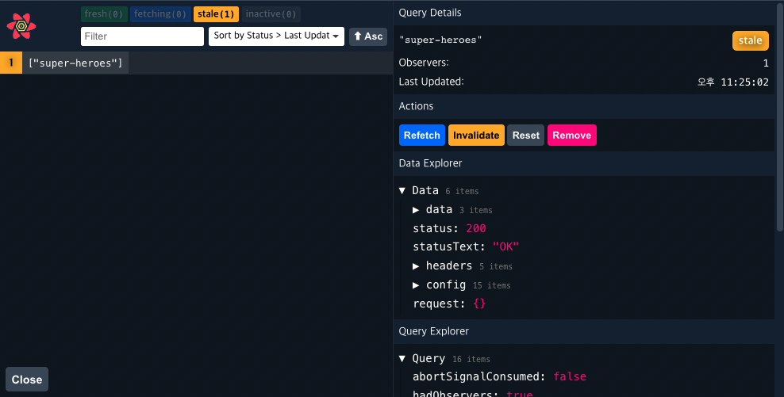

# React-query

https://www.youtube.com/watch?v=VtWkSCZX0Ec&list=PLC3y8-rFHvwjTELCrPrcZlo6blLBUspd2

https://react-query.tanstack.com/overview

https://kyounghwan01.github.io/blog/React/react-query/basic/#usequery

## What is?

리액트 어플리케이션에서 데이타를 fetching하는 라이브러리

## Why

1.  특정한 데이터 패칭 패턴이 없었다.

2.  useEffect 훅으로 데이터를 패칭하고 useState로 컴포넌트 내 state에서 loading, error나 결과 데이터를 유지해야했다.

3.  만약 데이터가 어플리케이션에 머무는 내내 필요하다면, 전역 상태 관리 라이브러리들로 유지하려는 경향들이 있다.

4.  대부분의 상태관리 라이브러리들은 정작 client State를 관리하는데 효율이 좋았다.

5.  대부분의 상태관리 라이브러리들은 비동기나 server state 작업에서 안좋다.
    - 캐싱... (아마도 프로그래밍에서 가장 어려운 일)
    - 동일한 데이터에 대한 여러 요청을 단일 요청으로 중복 제거
    - 백그라운드에서 "오래된" 데이터 업데이트
    - 데이터가 "오래된" 경우 파악
    - 데이터 업데이트를 최대한 빨리 반영
    - 페이지 매김 및 지연 로딩 데이터와 같은 성능 최적화
    - 서버 상태의 메모리 및 가비지 수집 관리
    - 구조적 공유를 통한 쿼리 결과 메모

```
React Query는 서버 상태를 관리하는 데 가장 좋은 라이브러리 중 하나입니다. 제로 구성으로 놀라울 정도로 즉시 사용할 수 있으며, 애플리케이션의 성장에 따라 원하는 대로 사용자 지정할 수 있습니다.
```

<br/>

## 예전 데이터 패칭 방식

```jsx
const RQSuperHeroesPage = () => {
	// fetching 관련 state 만들고
	const [isLoading, setIsLoading] = useState(true);
	const [data, setData] = useState([]);

	useEffect(() => {
		// useEffect에서 비동기함수 마운트에 실행하고
		axios.get("http://localhost:4000/superheroes").then((res) => {
			setData(res.data);
			setIsLoading(false);
		});
	}, []);

	if (isLoading) {
		return <h2>Loading...</h2>;
	}

	return (
		<>
			<h2>Super Heroes Page</h2>
			{data.map((hero) => {
				return <div>{hero.name}</div>;
			})}
		</>
	);
};
```

> 이제 react-query로 3줄안에 구현할 수 있다.

```jsx
import { useQuery } from "react-query";
import axios from "axios";

const fetchSuperHeroes = () => {
	return axios.get("http://localhost:4000/superheroes");
};

const RQSuperHeroesPage = () => {
	// useQuery 훅스의 첫번째 인자는 key, 이걸로 유니크한 아이디를 만들어 캐싱데이터를 저장하고 추적한다.
	// 두번째는 promise을 리턴하는 함수다.
	const { isLoading, data } = useQuery("super-heroes", fetchSuperHeroes);

	if (isLoading) {
		return <h2>Loading...</h2>;
	}
	return (
		<>
			<h2>Super Heroes Page</h2>
			{data?.data.map((hero) => {
				return <div key={hero.name}>{hero.name}</div>;
			})}
		</>
	);
};

export default RQSuperHeroesPage;
```

## Devtools

react-query에서는 시각적으로 확인할 수 있게 devtool도 지원한다.

```tsx
import { ReactQueryDevtools } from "react-query/devtools";

export default () => {
	return (
		<>
			<ReactQueryDevtools initialisOpen={false} position='botton-right' />
			// 브라우저에서 Next.js처럼 devtool 아이콘 확인 가능
		</>
	);
};
```



<br/>

## Cache

네트워크 탭에서 네트워크 속도를 낮추고 페이지를 왔다리 갔다리 해보면

첫 요청 이후로 loading없이 데이터가 바로 오는 걸 확인할 수 있다.

**react-query에서 캐싱된 데이터를 가져왔기 때문이다.**

```tsx
const { isLoading, data, error, isError } = useQuery(
	"super-heroes",
	fetchSuperHeroes,
	{
		cacheTime: 5000, // 기본적으로 5분마다 삭제되지만 조정할 수도 있다.
	}
);
```
